# Lovejoy’s Antique Evaluation Web Application - Coursework Report

## Table of Contents

1. **Introduction**
2. **Self-Reflection**
3. **Task 1: User Registration**
4. **Task 2: Secure Login Feature**
5. **Task 3: Password Policy and Recovery**
6. **Task 4: Evaluation Request Page**
7. **Task 5: Evaluation Listing Page (Admin Only)**
8. **Task 6: AWS Virtual Private Cloud (VPC) Setup**

## 1. Introduction

Within this report I will document the development process and implementation for the secure web application "Lovejoy’s Antique Evaluation Web Application." This project has been designed to deliver a secure application for the evaluation of antiques. Within the application there will be security measures taken place, including SQL injection, XSS, and CSRF defense. To support this I will be providing annotated code snippets and screenshots.

- **Code Repository**: [jtlovejoy](https://github.com/jt-Uni/jtlovejoy.git)
- **Recording**: [Recording](https://sussex.cloud.panopto.eu/Panopto/Pages/Viewer.aspx?id=c99003b5-3af5-4229-b776-b23d0004f76f)

## Task 0: Self-reflection

| **Marking Criteria**                  | **Sub Criteria**                                         | **Tick/Cross** | **Marks** |
|---------------------------------------|----------------------------------------------------------|----------------|-----------|
| **Password Policy**                   | Password entropy                                         |       X        |    12     |
|                                       | Security questions                                       |       x        |           |
|                                       | Password recovery                                        |       X        |           |
| **Vulnerabilities**                   | SQL injection                                            |       X        |    13     |
|                                       | XSS                                                      |       X        |           |
|                                       | CSRF                                                     |       X        |           |
|                                       | File Upload and Any other obvious vulnerability          |       X        |           |
| **Authentication/Encrypted Storage**  | User registration, User login                            |       x        |    10     |
|                                       | Email verification for  registration                     |                |           |
|                                       | 2-factor authentication (PIN and/or email)               |       x        |           |
|                                       | Encrypted storage                                        |       x        |           |
| **Obfuscation/Common Attacks**        | Brute force attack – Number of attempts                  |                |     8     |
|                                       | Botnet attack – Captcha                                  |       x        |           |
|                                       | Dictionary attack/Rainbow table attack                   |       x        |           |
| **Features of Web Application**       | Database design                                          |       x        |     30    |
|                                       | User registration                                        |       x        |           |
|                                       | User login                                               |       x        |           |
|                                       | Forgot password                                          |       x        |           |
|                                       | Evaluation                                               |       x        |           |
|                                       | List evaluation                                          |       x        |           |
| **VPC**                               | Evidence provided                                        |       x        |     10    |
| **Video**                             | All the marking criteria covered                         |       x        |     6     |
| **Self-Reflection**                   | This marking grid filled out properly                    |       x        |     4     |

**Total Marks** = 93

## Task 1: User Registration

### Overview

The user registration system will allow users to create their account. They will need to provide their name, email, password, and contact number. The implementation will focus on the usability and ensure there is security enforced. This will increase the integrity and protection against attacks.

---

### Input Validation

First off was input validation. This implementation uses the user's input data, which met the formation and prevents the chance of invalid or malicious inputs.

- **Name Validation:** Only allows alphabetic characters and spaces.
- **Email Validation:** Uses `filter_var()` to check the email format.
- **Password Strength:** Enforces strong passwords with at least one uppercase letter, one lowercase letter, one number, and one special character.
- **Contact Number Validation:** Ensures a 10-digit numeric format.

```php
$name = htmlspecialchars(trim($_POST['name']));
$email = filter_var(trim($_POST['email']), FILTER_SANITIZE_EMAIL);
$password = $_POST['password'];
$contact = htmlspecialchars(trim($_POST['contact']));

if (!preg_match('/^[a-zA-Z\s]+$/', $name)) {
    $errorMessage = 'Name must only contain letters and spaces';
} elseif (!filter_var($email, FILTER_VALIDATE_EMAIL)) {
    $errorMessage = 'Invalid email address';
} elseif (!preg_match('/^\d{10}$/', $contact)) {
    $errorMessage = 'Contact number must be exactly 10 digits';
} elseif (!preg_match('/^(?=.*[A-Z])(?=.*[a-z])(?=.*\d)(?=.*[@$!%*?&])[A-Za-z\d@$!%*?&]{8,}$/', $password)) {
    $errorMessage = 'Password must be at least 8 characters long, include an uppercase letter, a number, and a special character.';
}
```

### Password Hashing

To implement the password protection in my project, I used crypt to hash securely. This ensures that they are not stored in plaintext. This would protect against the chance of data breaches.

```php
$hashedPassword = password_hash($password, PASSWORD_BCRYPT);
```

### Database Interaction

To insert the user data into the database, I prepared SQL statements. These will mitigate the risk of SQL injection.

```php
$stmt = $pdo->prepare("INSERT INTO users (name, email, password, contact_number) VALUES (?, ?, ?, ?)");
$stmt->execute([$name, $email, $hashedPassword, $contact]);
```

To ensure that error handling is controlled gracefully. I have outlined the chance of duplicate email registrations or other database issue in an error report.

```php
if ($e->getCode() == 23000) {
    $errorMessage = "Email already exists. Please choose another one.";
} else {
    error_log("Database error: " . $e->getMessage());
    $errorMessage = "Something went wrong. Please try again later.";
}
```

### Database Design

When designing the users' table scheme, I had to take into account the data integrity and the support for role-based access in the future. To implement the scheme, I did the following:

- Primary Key: `id` - A unique identifier for each user.
- Unique Constraint: `email` - Prevents duplicate email registrations.
- Additional Fields:
  - `password`: Stores bcrypt-hashed passwords.
  - `role`: Defaulted to user for role-based access control.
  - `created_at`: Timestamp for user creation.

```sql
CREATE TABLE IF NOT EXISTS users (
    id INT AUTO_INCREMENT PRIMARY KEY,
    name VARCHAR(100) NOT NULL,
    email VARCHAR(255) UNIQUE NOT NULL,
    password VARCHAR(255) NOT NULL,
    contact_number VARCHAR(15),
    role ENUM('user', 'admin') DEFAULT 'user',
    created_at TIMESTAMP DEFAULT CURRENT_TIMESTAMP
);
```

---

### Security Analysis

Password Security:

- Passwords are hashed using crypt with a secure salt.

```php
$hashedPassword = password_hash($password, PASSWORD_BCRYPT);
```

- Implementation of password requirements to enforce and prevent weak user credentials.

```php
!preg_match('/^(?=.*[A-Z])(?=.*[a-z])(?=.*\d)(?=.*[@$!%*?&])[A-Za-z\d@$!%*?&]{8,}$/', $password)
```

SQL Injection Prevention:

- Before inputting the data into the database, the queries are prepared. This ensures the user inputs are text data and not malicious executable code.

```php
$name = htmlspecialchars(trim($_POST['name']));
$email = filter_var(trim($_POST['email']), FILTER_SANITIZE_EMAIL);
$contact = htmlspecialchars(trim($_POST['contact']));
```

Input Validation:

- Enforcing strict validation for input fields. This reduced the chance of harmful data being stored in the database.
- Error Handling
- Graceful handling of errors like duplicate emails prevents unnecessary information disclosure.

## Task 2: Secure Login Feature

### Overview

The login page contains functionality that will ensure only registered users can access the system. This will be done by confirming their credentials. This section of the report will outline my implementation of a secure user login/authentication page.

---

### Input Validation

Users will input their data, and it will be validated to ensure that the email data is sanitized before processing.

```php
$email = filter_var(trim($_POST['email']), FILTER_SANITIZE_EMAIL);
$password = $_POST['password'];

if (!filter_var($email, FILTER_VALIDATE_EMAIL)) {
    $errorMessage = 'Invalid email address.';
}
```

### Password Verification

I have utilized `password_verify` to verify the hashed password saved within the database. This is then compared against the user-provided password.

```php
$stmt = $pdo->prepare("SELECT id, name, role, password FROM users WHERE email = ?");
$stmt->execute([$email]);
$user = $stmt->fetch(PDO::FETCH_ASSOC);

if ($user && password_verify($password, $user['password'])) {
  // Store user information in session
  $_SESSION['user_id'] = $user['id'];
  $_SESSION['name'] = $user['name'];
  $_SESSION['role'] = $user['role'];

  header('Location: dashboard.php');
  exit; // Prevent further code execution
}
```

### reCAPTCHA

```php
$recaptchaSecret = $_ENV['RECAPTCHA_SECRET'];

if (!$responseKeys["success"]) {
    $errorMessage = "reCAPTCHA verification failed. Please try again.";
} else {...}
```

```html 
<div class="g-recaptcha" data-sitekey="6Leal5IqAAAAAPqLyPcvTiiHDhjolvOkhxdQmdBq" data-action="LOGIN"></div>
```

### Session Handling

After a successful login has been completed and confirmed, a session is initiated for the user. This will ensure that their access is protected.

```php
session_start();

$_SESSION['user_id'] = $user['id'];
$_SESSION['name'] = $user['name'];
$_SESSION['role'] = $user['role'];
```

#### Error Handling

Proper error handling is implemented to prevent information disclosure:

- Generic error messages for invalid login attempts.
- Logging of critical database errors for debugging.

```php
catch (PDOException $e) {
  error_log("Database error during login: " . $e->getMessage());
  $errorMessage = "Something went wrong. Please try again later.";
}
```

### Security Measures

Password Hashing and Verification:

- The passwords saved to the database are securely hashed using bcrypt.
- `password_verify()` This will ensure that the password and stored hash number match.

```php
password_verify($password, $user['password'])
```

Input Validation and Sanitization:

- Make sure the inputs are sanitized and valid. This will prevent malicious data injection.

```php
$email = filter_var(trim($_POST['email']), FILTER_SANITIZE_EMAIL);
```

SQL Injection Prevention:

- All database queries are executed using prepared statements to mitigate SQL injection risks.

```php
$stmt = $pdo->prepare("SELECT id, name, role, password FROM users WHERE email = ?");
```

Session Security:

- Sessions have been implemented to manage the authentication of the user securely.
- Session IDs are regenerated upon login to prevent session fixation attacks.

## Task 3: Password Policy and Recovery

### Overview

Task three focused on the implementation of strong password policies and a secure recovery mechanism for passwords. This policy for the password is a requirement to enhance security. The recovery mechanism will allow users to reset passwords.

---

### Password Policy

The policy will ensure that all the users meet a minimum security requirement:

- Minimum length of 8 characters.
- At least one uppercase letter, one lowercase letter, one number, and one special character.

Validation is implemented using a regular expression:

```php
if (!preg_match('/^(?=.*[A-Z])(?=.*[a-z])(?=.*\d)(?=.*[@$!%*?&])[A-Za-z\d@$!%*?&]{8,}$/', $password)) {
    $errorMessage = 'Password must be at least 8 characters long, include an uppercase letter, a number, and a special character.';
}
```

### Password Recovery

The password recovery system provides users the ability to reset their password via a secure token-based system:

- **Request Reset:** The user submits their email address to request a password reset.
- **Generate Token:** A unique, time-limited token is generated and emailed to the user.
- **Verify Token:** The token is verified when the user clicks the reset link.
- **Reset Password:** The user enters a new password, which is validated and securely stored.

**Token Generation:** A unique token is generated using PHP’s bin2hex() and random_bytes() functions:

```php
$token = bin2hex(random_bytes(32));
$expiry = date('Y-m-d H:i:s', strtotime('+1 hour'));

$stmt = $pdo->prepare("UPDATE users SET password = ?, reset_token = NULL, reset_token_expiry = NULL WHERE id = ?");
$stmt->execute([$hashedPassword, $user['id']]);
```

**Emailing the Token:** The token is sent to the user’s email address with a reset link:

```php
 // Generate a secure reset link
  $resetToken = bin2hex(random_bytes(16)); // Secure token generation
  $resetLink = "http://localhost:8080/src/views/resetPassword.php?token=$resetToken";
  $expiryTime = date('Y-m-d H:i:s', strtotime('+1 hour')); // Token expires in 1 hour

  // Save the reset token and expiry time to the database
  $stmt = $pdo->prepare("UPDATE users SET reset_token = ?, reset_token_expiry = ? WHERE email = ?");
  $stmt->execute([$resetToken, $expiryTime, $email]);

  if ($stmt->rowCount() === 0) {
      throw new Exception("Email not found or update failed.");
  }

  // Initialize PHPMailer
  $mail = new PHPMailer(true);

  // SMTP configuration (using SendGrid)
  $mail->isSMTP();
  $mail->Host = 'smtp.gmail.com';
  $mail->SMTPAuth = true;
  $mail->Username = ($_ENV['GMAIL_USERNAME']); // Use environment variable for security
  $mail->Password = ($_ENV['GMAIL_PASSWORD']); // Use environment variable for security
  $mail->SMTPSecure = PHPMailer::ENCRYPTION_STARTTLS;
  $mail->Port = 587;

  // Email settings
  $mail->setFrom('james.steve.taylor@gmail.com', 'Lovejoys Antique'); // Replace with your email and app name
  $mail->addAddress($email); // Add recipient

  // Email content
  $mail->isHTML(true);
  $mail->Subject = 'Password Reset Request';
  $mail->Body = "Hello,<br><br>We received a request to reset your password. You can reset it by clicking the link below:<br>
                 <a href=\"$resetLink\">Reset Password</a><br><br>
                 If you did not request this, please ignore this email.<br><br>Thank you.";

  // Send the email
  $mail->send();
```

**Token Verification:** The token is validated against the database to ensure it is valid and not expired.

```php
$stmt = $pdo->prepare("SELECT id FROM users WHERE reset_token = ? AND reset_token_expiry > NOW()");
$stmt->execute([$resetToken]);
$user = $stmt->fetch(PDO::FETCH_ASSOC);
```

**Password Update:** Once verified, the user’s password is hashed and updated in the database:

```php
if ($user) {
    $hashedPassword = password_hash($password, PASSWORD_BCRYPT);

    $stmt = $pdo->prepare("UPDATE users SET password = ?, reset_token = NULL, reset_token_expiry = NULL WHERE id = ?");
    $stmt->execute([$hashedPassword, $user['id']]);

    echo "Password has been successfully reset. <a href='login.php'>Login here</a>.";
    exit;
  } else {
$errorMessage = 'Invalid or expired reset token.';
}
```

---

### Security Measures

Password Policy Enforcement:

- Ensuring password requirements that are strong. This reduces brute force attacks.

```php
if (empty($resetToken)) {
  $errorMessage = 'Invalid or missing reset token.';
} elseif ($password !== $confirmPassword) {
  $errorMessage = 'Passwords do not match.';
} elseif (!preg_match('/^(?=.*[A-Z])(?=.*[a-z])(?=.*\d)(?=.*[@$!%*?&])[A-Za-z\d@$!%*?&]{8,}$/', $password)) {
  $errorMessage = 'Password must be at least 8 characters long, include an uppercase letter, a number, and a special character.';
}
```

-- Rehashing the password

```php
 if ($user) {
  $hashedPassword = password_hash($password, PASSWORD_BCRYPT);

  $stmt = $pdo->prepare("UPDATE users SET password = ?, reset_token = NULL, reset_token_expiry = NULL WHERE id = ?");
  $stmt->execute([$hashedPassword, $user['id']]);

  header('Location: login.php?message=Password reset successfully');
  exit;
}
```

- Providing real-time password strong increases user enjoyment.

Token Security:

- Tokens are stored securely and expire after a short time.
- Tokens are stored hashed in the database to prevent exposure.

Email Validation:

- Emails are validated to ensure they are properly formatted.
- Reset links are sent only to registered email addresses.

Rate Limiting:

- Prevents abuse of the password recovery system by limiting the number of reset requests per hour.

## Task 4: Evaluation Request Page

### Overview

The evaluation request page will allow users who have logged in to submit antique evaluations. This will include details about the evaluation, including a description, method of contact, and a photo of the item. The implementation will also include security to prevent uploads of malicious files that could compromise user data.

---

### Form Structure

This form has been designed to allow users to input and ensure the safe handling of data.
The following fields are included in the uploading process.

- **Comment Box:** Description for the item.
- **Contact Method Dropdown:** Options for email or phone inputs.
- **File Upload:** Enables users to upload an image of the item.

```html
<form action="evaluationRequest.php" method="POST" enctype="multipart/form-data">
  <label for="description">Description:</label>
  <textarea name="description" required></textarea><br>

  <label for="contactMethod">Preferred Contact Method:</label>
  <select name="contactMethod" required>
    <option value="email">Email</option>
    <option value="phone">Phone</option>
  </select><br>

  <label for="photo">Upload Photo:</label>
  <input type="file" name="photo" accept="image/*" required><br>

  <button type="submit">Submit Request</button>
</form>
```

---

### Server-Side Handling

The backend will control the processes of the secure inputs on the form:

1. **Input Validation:** Ensures all fields are correctly filled and sanitized.
2. **File Validation:** Restricts file uploads to safe types and limits size.

```php
// Validate inputs
$comment = htmlspecialchars(trim($_POST['comment']));
$contact_method = htmlspecialchars(trim($_POST['contact_method']));
$user_id = $_SESSION['user_id'];

// Validate file upload
if (!empty($_FILES['photo']['name'])) {
  $allowed_types = ['image/jpeg', 'image/png', 'image/gif'];
  if (!in_array($_FILES['photo']['type'], $allowed_types)) {
    $errorMessage = "Invalid file type. Only JPEG, PNG, and GIF are allowed.";
  } elseif ($_FILES['photo']['size'] > 5 * 1024 * 1024) {
    $errorMessage = "File size exceeds the 5MB limit.";
  } else {
    // Move file to a secure location
    $upload_dir = __DIR__ . '/../../uploads/';
    $file_name = uniqid() . '_' . basename($_FILES['photo']['name']);
    $upload_path = $upload_dir . $file_name;

    if (!move_uploaded_file($_FILES['photo']['tmp_name'], $upload_path)) {
      $errorMessage = "Failed to upload the file.";
    }
  }
}

// Store the request in the database
if (empty($errorMessage)) {
  try {
    $stmt = $pdo->prepare("INSERT INTO evaluation_requests (user_id, comment, contact_method, photo) VALUES (?, ?, ?, ?)");
    $stmt->execute([$user_id, $comment, $contact_method, $file_name]);

    header('Location: dashboard.php?success=1');
    exit;
  } catch (PDOException $e) {
    error_log("Database error during evaluation request: " . $e->getMessage());
    $errorMessage = "Something went wrong. Please try again later.";
  }
}
```

---

### Database Design

The `evaluation_requests` table stores the submitted requests with the following schema:

```sql
CREATE TABLE evaluation_requests (
    id INT AUTO_INCREMENT PRIMARY KEY,
    user_id INT NOT NULL,
    description TEXT NOT NULL,
    contact_method ENUM('email', 'phone') NOT NULL,
    photo_path VARCHAR(255) NOT NULL,
    created_at TIMESTAMP DEFAULT CURRENT_TIMESTAMP,
    FOREIGN KEY (user_id) REFERENCES users(id) ON DELETE CASCADE
);
```

Key features:

- **Foreign Key:** Links requests to the respective user for accountability.
- **Photo Path:** Stores the file path of the uploaded photo.

---

### Security Measures

Input Sanitization:

- Special characters are removed to prevent any XSS attacks.
- Dropdowns are validated to make sure they are expected options.

File Upload Validation:

- Restricts allowed file types to images (JPEG, PNG, GIF).
- Limits file size to prevent the change of storage abuse.

Directory Isolation:

- Any uploaded files are in a web root that is outside the directory.
- All filenames are unique to prevent overwriting.

CSRF Protection:

- CSRF tokens are implemented to prevent unauthorized form submissions.

Access Restriction:

- Only logged-in users can access and submit the form.

## Task 5: Evaluation Listing Page (Admin Only)

### Overview

The listing page is an admin-only area that allows admins to view all the evaluations that have been submitted by users. This feature is core to the web application because it allows the ability to manage and process user evaluation submissions. This is an effective way of restricting access to the sensitive data of the users.

---

### Code Snippets

#### Access Restriction

To access the page you'll need administrator permissions. This is a session role-based system. Meaning that only users who are logged in and have the admin role can view this page.

```php
session_start();

// Check if user is logged in and has the 'admin' role
if (!isset($_SESSION['user_id']) || $_SESSION['role'] !== 'admin') {
    header("Location: login.php");
    exit;
}
```

#### Displaying Evaluation Requests

Once the user has logged in with an administrator role, the evaluations are fetched from the database. They are then displayed in a table with simple pagination.

```php
try {
  $stmt = $pdo->query("
        SELECT
            evaluation_requests.id,
            users.name AS user_name,
            users.email AS user_email,
            evaluation_requests.comment,
            evaluation_requests.contact_method,
            evaluation_requests.photo,
            evaluation_requests.created_at
        FROM evaluation_requests
        INNER JOIN users ON evaluation_requests.user_id = users.id
        ORDER BY evaluation_requests.created_at DESC;
    ");
  $requests = $stmt->fetchAll(PDO::FETCH_ASSOC);
}
```

#### HTML Table for Display

The retrieved data is displayed in a table with a download link for the uploaded photos.

```html
<table>
  <thead>
    <tr>
      <th>User Name</th>
      <th>Email</th>
      <th>Comment</th>
      <th>Contact Method</th>
      <th>Photo</th>
      <th>Created At</th>
      <th>Actions</th>
    </tr>
  </thead>
  <tbody>
    <?php foreach ($requests as $request): ?>
      <tr>
        <td><?php echo htmlspecialchars($request['user_name']); ?></td>
        <td><?php echo htmlspecialchars($request['user_email']); ?></td>
        <td><?php echo htmlspecialchars($request['comment']); ?></td>
        <td><?php echo htmlspecialchars($request['contact_method']); ?></td>
        <td>
          <a href="../../uploads/<?php echo htmlspecialchars($request['photo']); ?>" target="_blank">View</a>
        </td>
        <td><?php echo htmlspecialchars($request['created_at']); ?></td>
        <td>
          <form action="../controllers/deleteRequestController.php" method="POST"
            onsubmit="return confirm('Are you sure you want to delete this request?');">
            <input type="hidden" name="request_id" value="<?php echo $request['id']; ?>">
            <button type="submit">Delete</button>
          </form>
        </td>
      </tr>
    <?php endforeach; ?>
  </tbody>
</table>
```

If no data is returned to the request to the database. The table will show "No evaluation requests found."

```php
<?php else: ?>
  <p>No evaluation requests found.</p>
<?php endif; ?>
```

---

### Database Design

The `evaluation_requests` table supports this feature by storing all the relevant data. The schema is detailed in Task 4.

---

### Security Measures

Role-Based Access Control (RBAC):

- Only allowing users with the `admin` role to access the admin page.
- The session validates the user's role before allowing their access to the admin page.

Input Sanitization:

- The users provided data will be displayed. This requires sanitization.

Pagination:

- Protects against performance issues by limiting the number of rows displayed per page.

File Security:

- To view the uploaded files, access is restricted to users with the administrator role assigned.

Error Handling:

- Gracefully displaying an error message so when no data is retrieved or unauthorized access occurs, the website doesn't just error out.

---

### Testing and Results

The Evaluation Listing Page was tested with the following scenarios:

1. **Admin Access:** Tested to make sure that only admins were able to access the admin page.
2. **Non-Admin Access:** Tested to make sure that users without admin roles were denied access.
3. **File Access:** Tested to make sure that uploads were only able to be viewed by admins.

### Security Measures

Network Isolation:

- Private subnets are isolated from direct internet access, reducing the attack surface.

Least Privilege Access:

- Security groups restrict inbound and outbound traffic based on need-to-access policies.

Data Encryption:

- All traffic between instances is encrypted using HTTPS.
- Sensitive data in transit is routed securely through the private network.

Monitoring and Logging:

- Enabled AWS CloudWatch Logs and VPC Flow Logs for tracking traffic and identifying anomalies.
- Alarms configured to alert on suspicious activities.

Backup and Redundancy:

- Resources are distributed across multiple availability zones to prevent downtime.

## Task 6: AWS Virtual Private Cloud settings screen shots

- 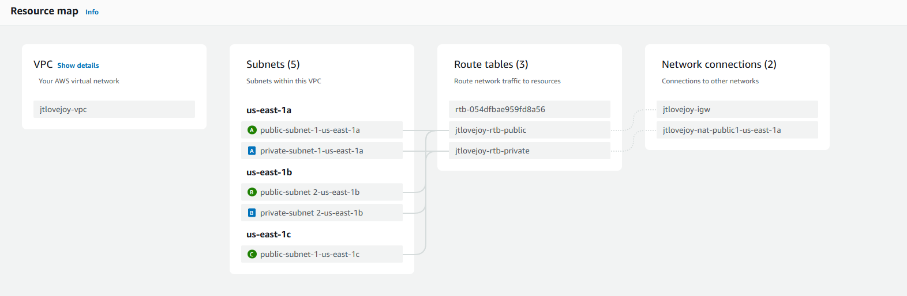
- 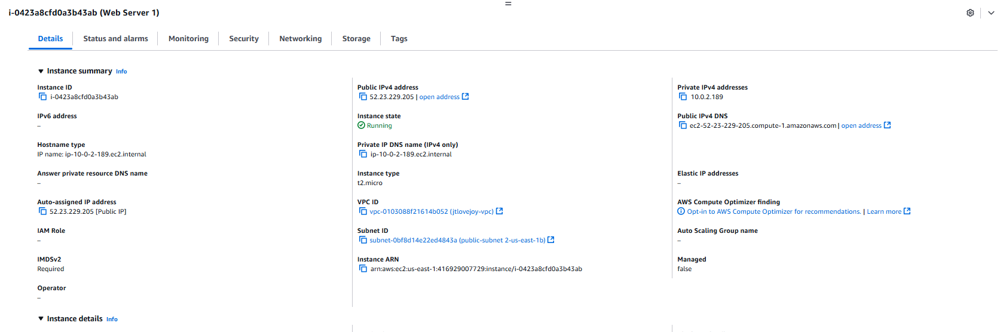
- 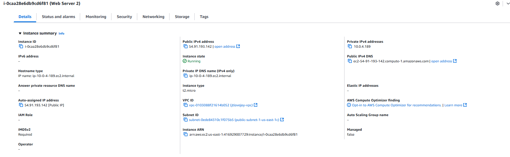
- 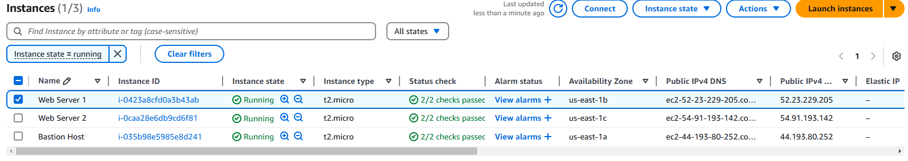
- 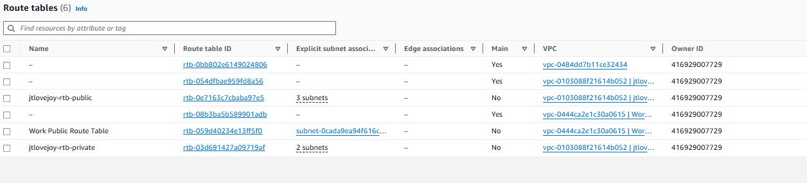
- 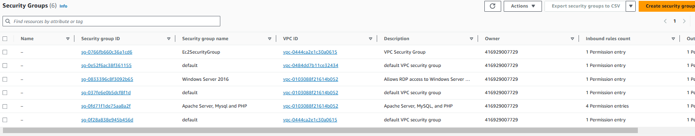
- 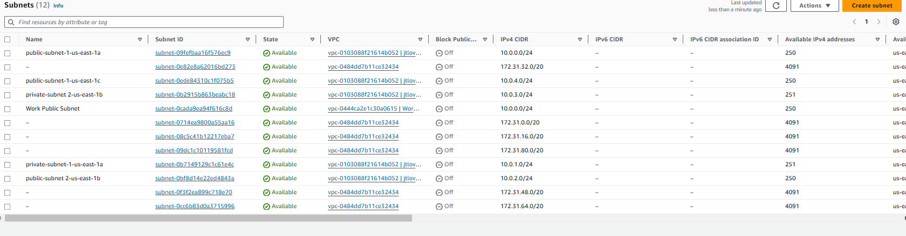
- 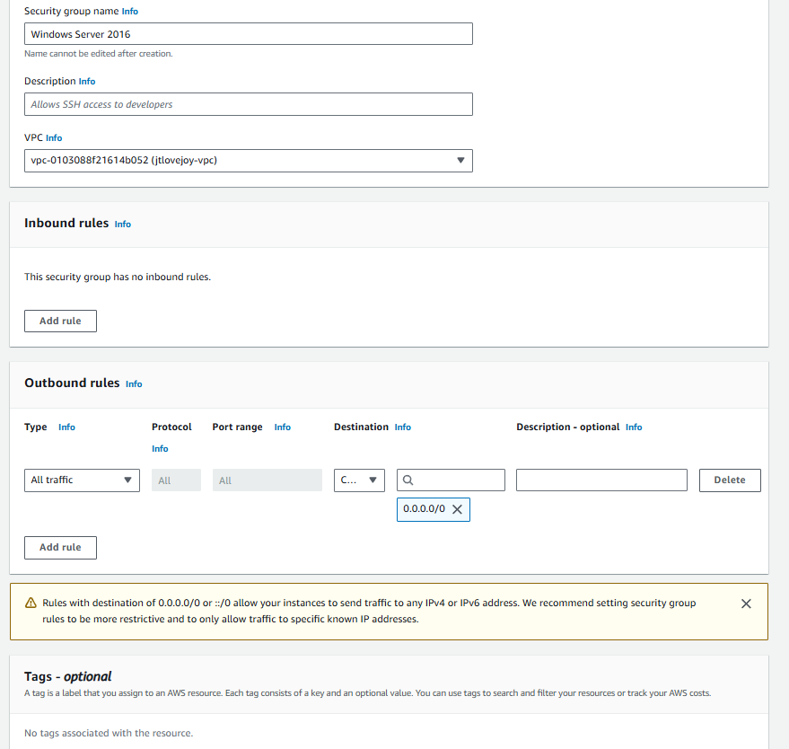
- 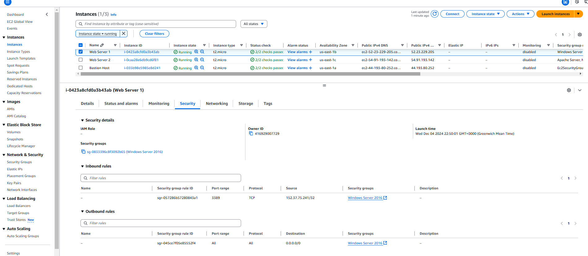
- 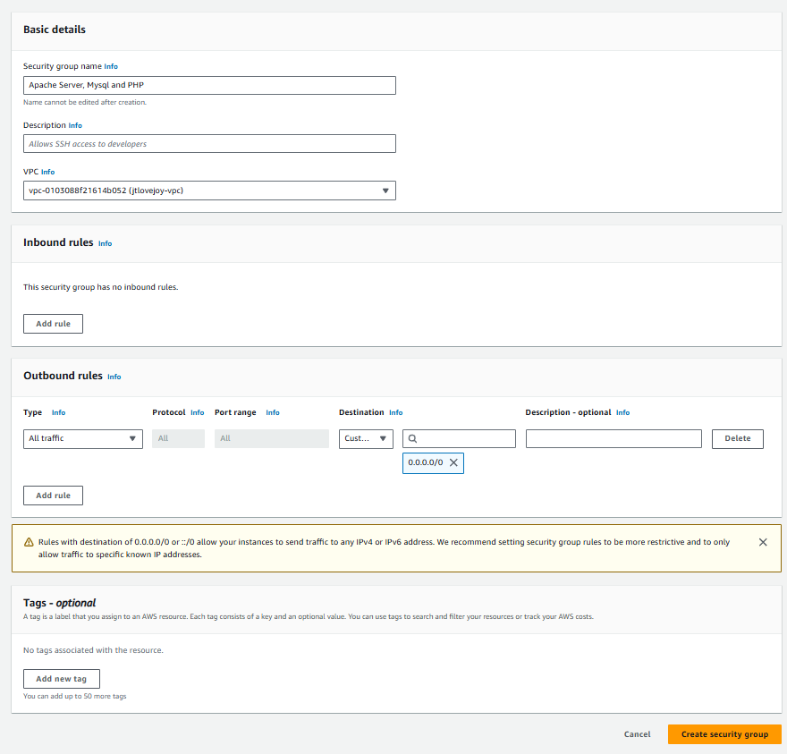
- 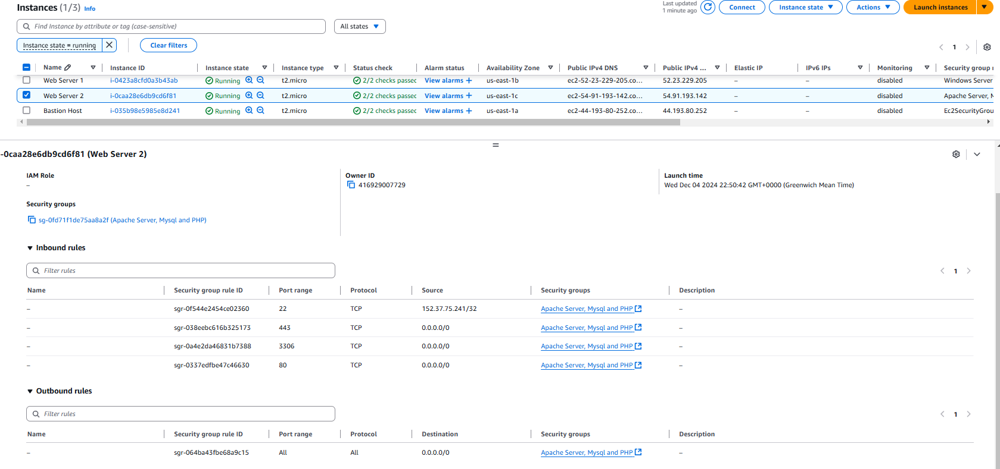
